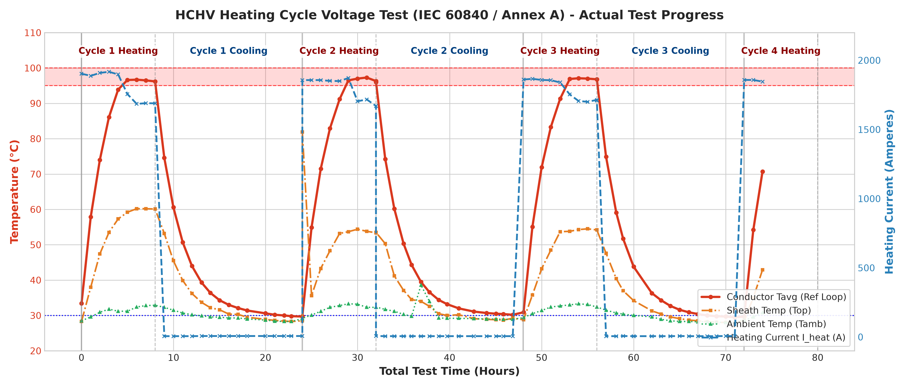
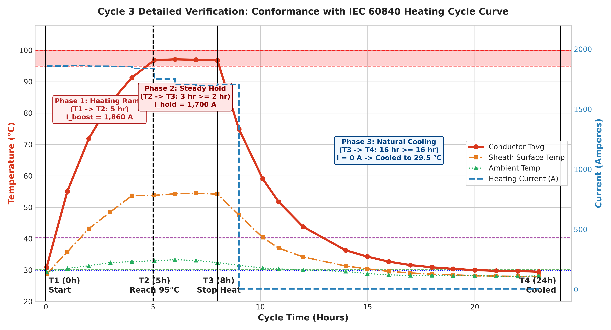

# HCHV Cable Heating Current Calculator & Analyzer (IEC 60840)

> เว็บแอปพลิเคชันและโมเดลคำนวณทำนายกระแสไฟฟ้าสำหรับทดสอบความร้อนสายไฟฟ้าแรงสูง **Heating Cycle Voltage Test** ตามมาตรฐาน **IEC 60840 Clause 12.4.6 & Annex A**
> อ้างอิงสเปกสายไฟ: **Bangkok Cable 115 kV 1x800 SQ.MM. Copper XLPE (ความยาวลูป 14 เมตร)**

---

## 🌟 ฟีเจอร์หลัก (Key Features)

1. **Interactive Real-Time Current Calculator**:
   - ปรับอุณหภูมิห้อง ($T_{amb}$), อุณหภูมิตัวนำเป้าหมาย ($T_{target}$), และเวลาช่วงเร่ง ($T_1 \to T_2$) ผ่าน Slider ได้ทันที
   - คำนวณกระแสจ่าย 2 จังหวะอัตโนมัติ:
     - **ช่วงที่ 1 ($I_{boost}$)**: กระแสเร่งอุณหภูมิจาก $T_{amb}$ ให้แตะ $95^\circ\text{C}$ ภายในเวลาที่กำหนด (เช่น 5 ชม.)
     - **ช่วงที่ 2 ($I_{hold}$)**: กระแสคงที่สำหรับล็อกอุณหภูมิให้อยู่ในกรอบ $95 - 100^\circ\text{C}$ นาน $\ge 2$ ชม.
2. **กราฟเจาะลึก 1 Cycle (Cycle 3) สอดคล้องตามไดอะแกรม IEC 60840**:
   - แสดงจุดเวลาสำคัญ $T_1, T_2, T_3, T_4$
   - สลับดูได้ 3 โหมด: **ข้อมูลจริงจากแล็บ (Actual Test Data)**, **เส้นจำลองตามโมเดล (Simulated Model)**, และ **เปรียบเทียบทั้งคู่ (Compare)**
   - รองรับ Dual-axis: อุณหภูมิ (°C) ทางซ้าย และกระแสจ่าย (A) ทางขวา
3. **สูตรประเมินอุณหภูมิตัวนำจากผิวเปลือกนอก (Method 2 per Annex A.3.2)**:
   - ป้อนค่าอุณหภูมิเซนเซอร์ผิวเปลือก ($TC_{sheath}$) เพื่อคำนวณอุณหภูมิตัวนำจริงภายในแบบ Real-time:
     $$T_{conductor} \approx TC_{sheath} + 1.81 \times (TC_{sheath} - T_{amb})$$
4. **ตรวจสอบเกณฑ์มาตรฐานอัตโนมัติ (Automated IEC Conformance Check)**:
   - ตรวจสอบ $T_1 \to T_3 \ge 8\text{ hr}$
   - ตรวจสอบ $T_2 \to T_3 \ge 2\text{ hr}$ ในช่วง $95 - 100^\circ\text{C}$
   - ตรวจสอบการระบายความร้อน $T_3 \to T_4 \ge 16\text{ hr}$ สู่ $\le 30^\circ\text{C}$ หรือ $\le T_{amb} + 10\text{ K}$

---

## 📊 กราฟวิเคราะห์ผลการทดสอบจริงจากแล็บ

### 1. กราฟภาพรวมทุกรอบ (Cycles 1 – 4)


### 2. กราฟเจาะลึก Cycle 3 เทียบไดอะแกรมมาตรฐาน


---

## 🔬 แบบจำลองทางคณิตศาสตร์ (Mathematical Model)

สกัดและ Calibrate จากผลการทดสอบจริงในฐานข้อมูล `HCHV_Test_Database.xlsx`:
- **ความต้านทานความร้อนรวมจริง ($R_{th}^{eff}$)**: $0.6923\text{ K}\cdot\text{m/W}$
- **ค่าคงที่เวลาทางความร้อน ($\tau$)**: $2.71\text{ ชั่วโมง}$
- **ความต้านทานไฟฟ้ากระแสสลับ ($R_{ac}$)**: $R_{ac}(T) = R_{20}[1 + 0.00393(T - 20)] \times 1.09$

---

## 💻 วิธีการเปิดใช้งาน (How to Use)

### 1. เปิดใช้งานผ่านเว็บ (GitHub Pages)
เมื่อเปิดฟังก์ชัน GitHub Pages บนคลังนี้ สามารถเข้าใช้งานผ่านเบราว์เซอร์บนมือถือ แท็บเล็ต หรือ PC ได้ทันที:
`https://Phatsaviit.github.io/HCHV-Heating-Calculator/`

### 2. รันแบบ Local
เปิดไฟล์ `index.html` บนเบราว์เซอร์ใดก็ได้โดยไม่ต้องติดตั้งโปรแกรมเพิ่มเติม

### 3. รันสคริปต์คำนวณผ่าน Python
```powershell
# คำนวณที่อุณหภูมิห้อง 32.5 °C เป้าหมาย 97.5 °C
python calculate_current.py --tamb 32.5 --target 97.5 --ramp_hrs 5.0
```

---

## 🏢 เกี่ยวกับโปรเจกต์
- **องค์กร**: บริษัท บางกอกเคเบิ้ล จำกัด (Bangkok Cable Co., Ltd.)
- **มาตรฐานอ้างอิง**: IEC 60840, IEC 60287-1-1, IEC 60853-2, TIS 2202-2547
